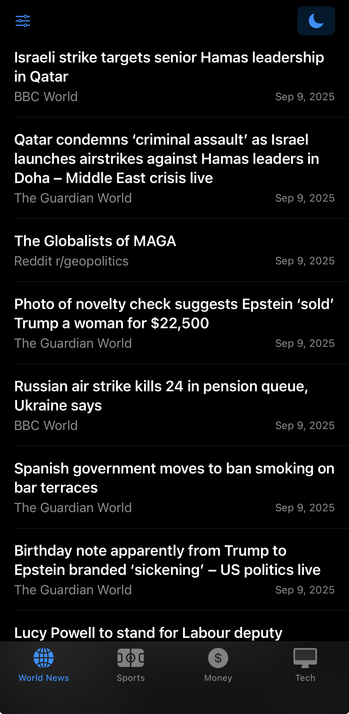
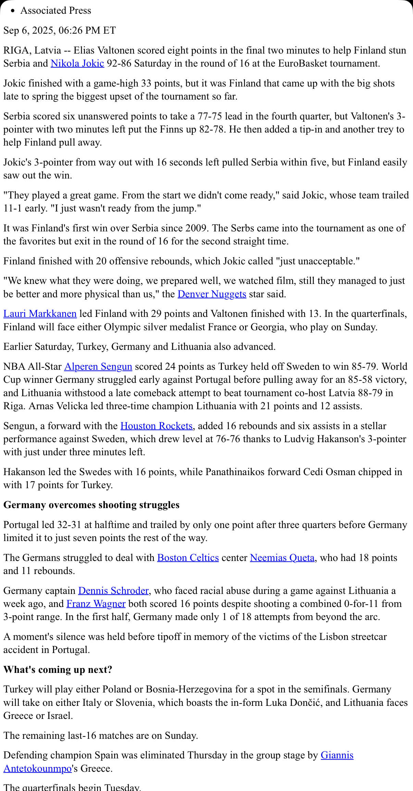
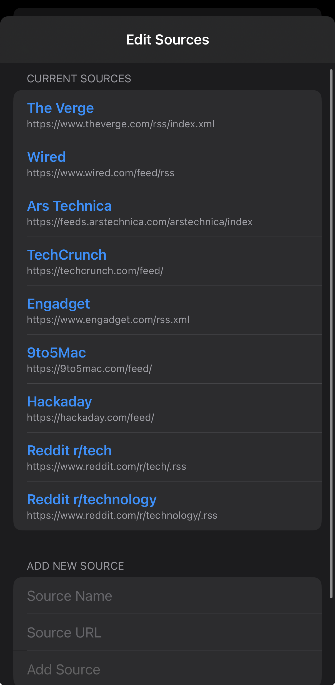

## news — A fast, focused RSS reader for iOS

[](https://developer.apple.com/ios/)
[](https://swift.org)
[](https://developer.apple.com/xcode/)
[](https://developer.apple.com/xcode/swiftui/)
[](LICENSE)

Take back your attention. news lets you choose the sources you trust across World News, Sports, Money, and Tech, then aggregates them into clean, fast lists. No algorithmic feeds, no infinite scroll traps — just the headlines you asked for, with optional Reader Mode to extract clean article content.

---

### Why
- **Own your feed**: Stop bouncing between random apps and scrolling through things you don't need.
- **Stay focused**: Curate only the sources you actually want, by topic.
- **Read faster**: Pull-to-refresh, unified lists, Reader Mode for clutter‑free reading.

---

### Features
- **Four tabs**: World News, Sports, Money, Tech
- **Custom sources per tab**: Add, edit, remove any RSS/Atom feed
- **Unified list view**: Merges and sorts all feeds by most recent
- **Reader Mode**: Extracts clean article content with Readability.js
- **Open in Safari**: Full article in `SFSafariViewController`
- **Pull-to-refresh**: Fetch latest in one gesture
- **Dark mode toggle**: Global preference saved
- **Local persistence**: Sources stored in `UserDefaults` per tab

---

### How it works (high level)
- SwiftUI front end with one `ViewModel` per tab
- Feeds fetched concurrently via `URLSession`
- RSS/Atom parsed using `XMLParser`, multiple date formats supported
- Articles merged and sorted descending by publish date
- Reader Mode loads page in `WKWebView` and injects bundled `Readability.js` to extract content

---

### Screenshots
Place PNG files under `docs/screenshots/` and replace these placeholders:

| Home | Reader Mode | Edit Sources |
|---|---|---|
|  |  |  |

Suggested capture names you can use:
- `home.png` — RootTabView showing a list of articles
- `reader.png` — ReaderModeView displaying extracted content
- `edit-sources.png` — EditSourcesView with sources list

---

### Getting started

#### Requirements
- Xcode 15 or newer
- iOS 17 SDK (adjust deployment target as needed)

#### Build and run
1. Clone the repo
   ```bash
   git clone https://github.com/<your-username>/news.git
   cd news
   ```
2. Open the project
   ```bash
   open news.xcodeproj
   ```
3. Select an iOS simulator or your device and press Run (⌘R)

No API keys are required. The app only fetches public RSS/Atom feeds.

---

### Usage
- Pick a tab (e.g., Tech) → pull to refresh → tap an article to open in Safari.
- Tap the top‑left slider icon on any tab to **Edit Sources** for that tab.
- Toggle the **sun/moon** icon to switch dark mode on/off.
- In article view, tap **Reader Mode** to extract clutter‑free content.

#### Editing sources
- Add: Enter a name and a valid http/https feed URL → Add Source
- Edit: Tap an existing source, change name/URL → Save Changes
- Delete: Swipe to delete in the list
- Errors: If a feed fails to parse, a warning icon and message appear next to it

#### Reader Mode
- Uses `Readability.js` to parse article content in a `WKWebView`
- Falls back to error text if extraction fails

---

### Architecture
- `newsApp` launches `RootTabView`
- Each tab owns its `ViewModel` (`WorldNewsViewModel`, `SportsViewModel`, `FinanceViewModel`, `TechViewModel`)
- `RSSParser` downloads and parses feeds concurrently, returning `[Article]`
- `ArticleListView` shows list, `ArticleDetailView` opens Safari + Reader Mode
- Sources are `Codable` and stored in `UserDefaults` (per-tab keys)

Key files:
- `news/newsApp.swift` — App entry
- `news/Views/RootTabView.swift` — Tabs, dark mode, source editors
- `news/ViewModels/*ViewModel.swift` — Per‑tab sources, persistence, fetching
- `news/Networking/RSSParser.swift` — Fetch, parse, merge, sort
- `news/Views/ReaderModeView.swift` — Reader Mode via `Readability.js`

---

### Privacy
- No accounts, no analytics, no third‑party SDKs
- No tracking or telemetry
- Only network calls are GET requests to the public feed URLs you configure

---

### Troubleshooting
- No articles appear:
  - Check feed URL is valid and publicly accessible
  - Some sites block bots; try another feed or the site's official RSS
  - Pull to refresh after adding/editing sources
- Reader Mode shows an error:
  - Not all pages are compatible with Readability extraction
  - Open in Safari to view the original page

---

### Roadmap
- Optional iCloud sync for sources
- Source import/export (OPML)
- Keyword filtering, mute lists
- Saved articles / offline reading
- Widgets and push refresh hooks

---

### Contributing
Contributions welcome! Please:
1. Open an issue describing the change or bug
2. Fork and create a feature branch
3. Keep edits focused; add tests where applicable
4. Open a PR referencing the issue

---

### License
MIT — see `LICENSE` for details. If not present, consider adding one of: MIT, Apache‑2.0, or GPL‑3.0 depending on your preference.

---

### FAQ
**Does this app use any private APIs?**  
No. It uses `URLSession`, `XMLParser`, `SFSafariViewController`, and `WKWebView`.

**Are there any API keys or secrets?**  
No. All feeds are public.

**Will it work with Atom feeds?**  
Yes — Atom is supported alongside RSS.

**Where are my sources stored?**  
Locally in `UserDefaults`, per tab.


